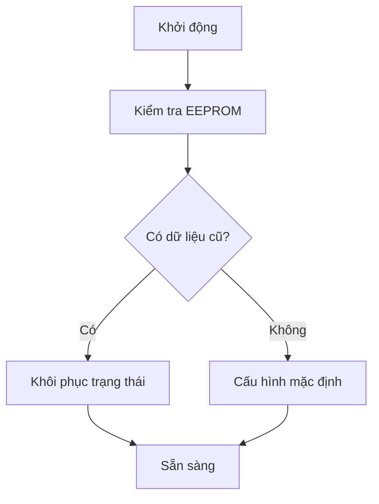
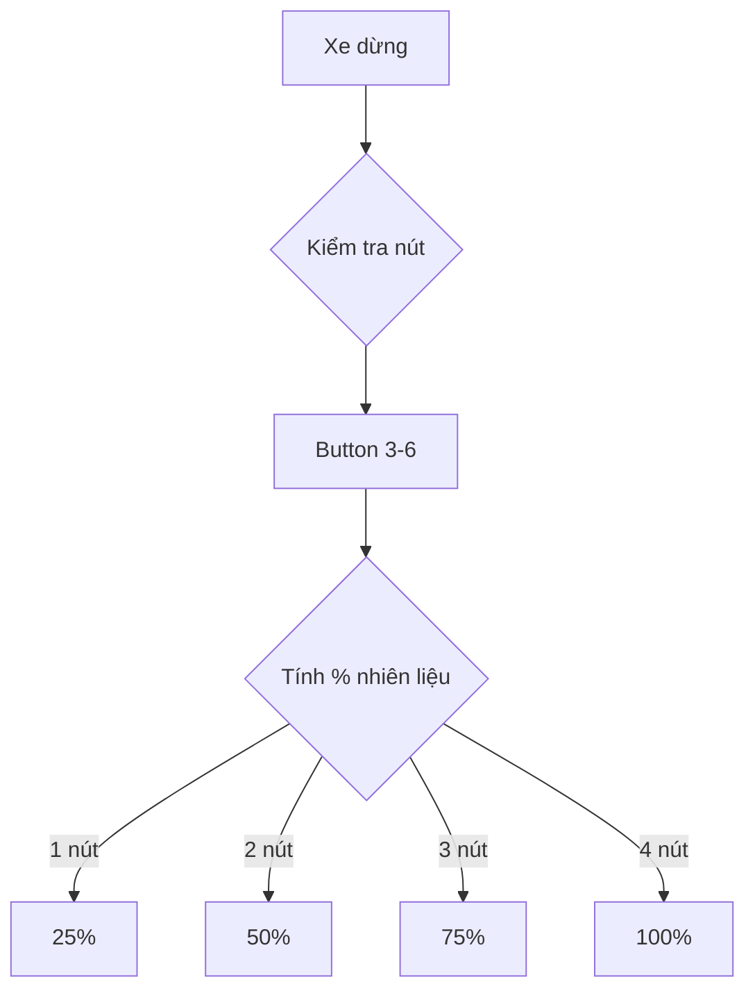
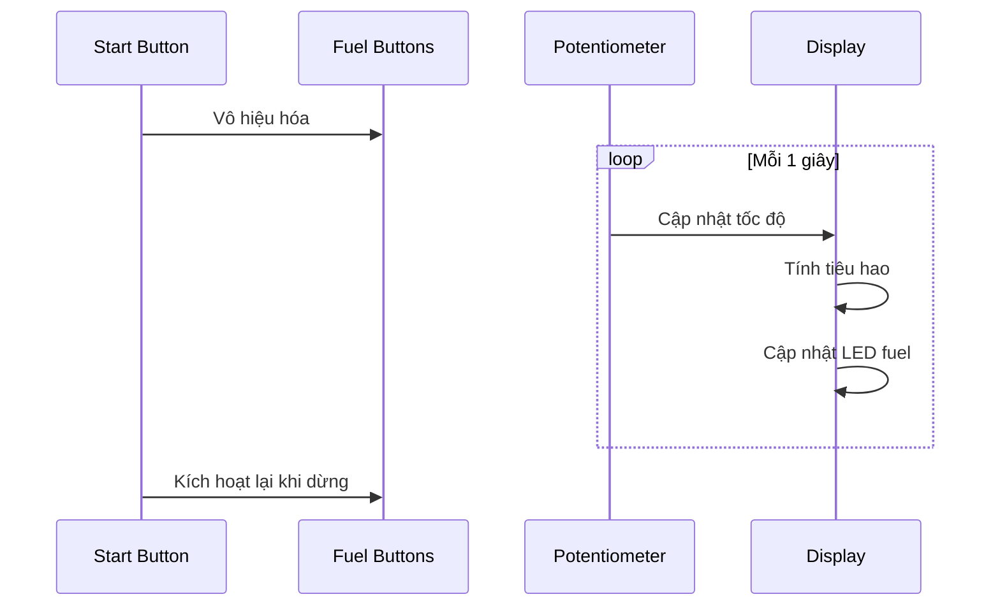
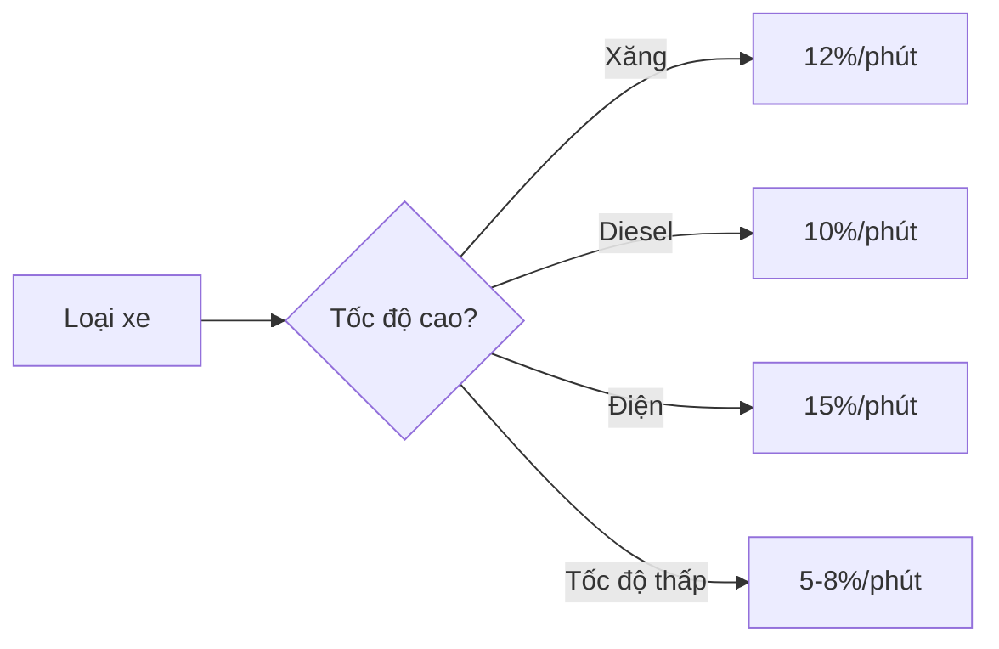

# Hệ Thống Dashboard Xe Đa Năng

## 1. Mô Tả Hệ Thống
Bảng điều khiển mô phỏng xe với khả năng chuyển đổi giữa các loại động cơ và chế độ lái khác nhau.

## 2. Tính Năng Chính

### 2.1. Chuyển Đổi Loại Xe
- **Button 1: Chuyển loại động cơ**
  * Xăng (Petrol)
  * Diesel
  * Điện (Electric)
  * LED RGB hiển thị trạng thái:
    - Đỏ: Xăng
    - Vàng: Diesel
    - Xanh: Điện

### 2.2. Chế Độ Lái
- **Button 2: Chuyển chế độ vận hành**
  * ECO: Tiết kiệm nhiên liệu/pin
  * NORMAL: Cân bằng
  * SPORT: Hiệu suất cao
  * LED RGB hiển thị:
    - Xanh lá: ECO
    - Trắng: NORMAL
    - Đỏ: SPORT

### 2.3. Điều Khiển Nhiên Liệu
- **4 Button Mô Phỏng Nạp Nhiên Liệu**
  * Button 3-6: Điều chỉnh mức nhiên liệu
  * Mỗi nút tương đương 25% mức nhiên liệu
  * Trạng thái hiển thị LED:
    - 1 nút = 25%
    - 2 nút = 50%
    - 3 nút = 75%
    - 4 nút = 100%

### 2.4. Điều Khiển Lái
- **Button 7: Start/Stop**
  * Start: Bắt đầu mô phỏng lái
  * Stop: Dừng xe, cho phép nạp nhiên liệu
  * Vô hiệu hóa buttons nạp khi đang chạy
  * Kích hoạt lại buttons theo mức còn lại khi dừng

### 2.5. Điều Khiển Tốc Độ
- **Biến Trở (Potentiometer)**
  * Điều chỉnh tốc độ mô phỏng
  * Range: 0-200 km/h
  * Ảnh hưởng đến mức tiêu thụ nhiên liệu

## 3. Quy Tắc Hoạt Động

### 3.1. Khởi Động Hệ Thống

### 3.2. Quy Trình Nạp Nhiên Liệu

### 3.3. Quy Trình Lái

## 4. Mô Phỏng Tiêu Hao

### 4.1. Tỷ Lệ Tiêu Hao Theo Loại

### 4.2. Ảnh Hưởng Chế Độ Lái
- **ECO Mode:**
  * Giảm 30% tiêu hao
  * Giới hạn tốc độ 60%

- **NORMAL Mode:**
  * Tiêu hao chuẩn
  * Không giới hạn tốc độ

- **SPORT Mode:**
  * Tăng 20% tiêu hao
  * Tăng 10% tốc độ tối đa

## 5. Lưu Trữ EEPROM
- Loại xe cuối cùng
- Chế độ lái cuối
- Mức nhiên liệu
- Số km đã đi
- Thời gian vận hành
