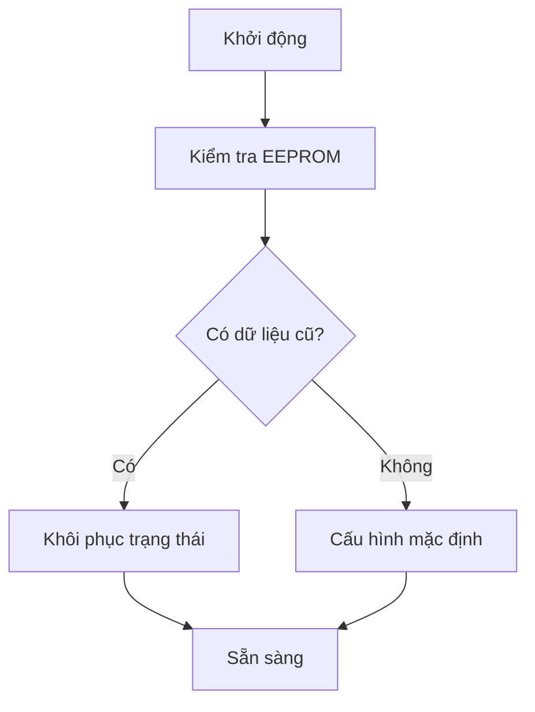
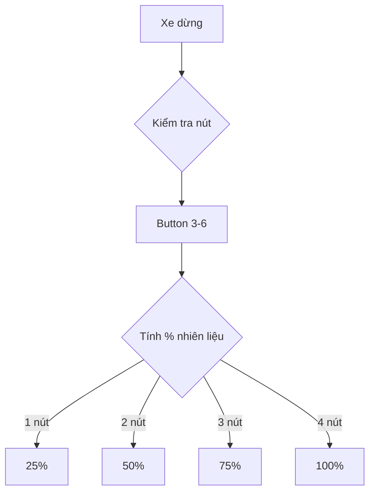
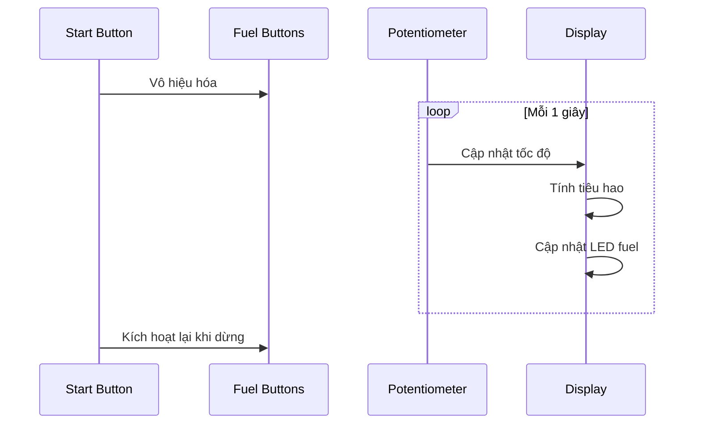
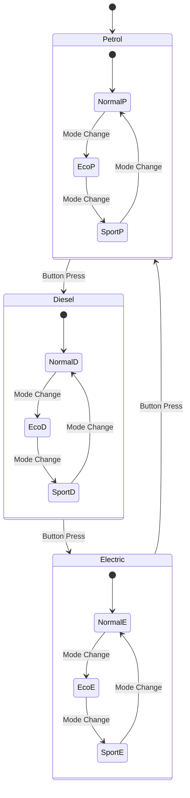
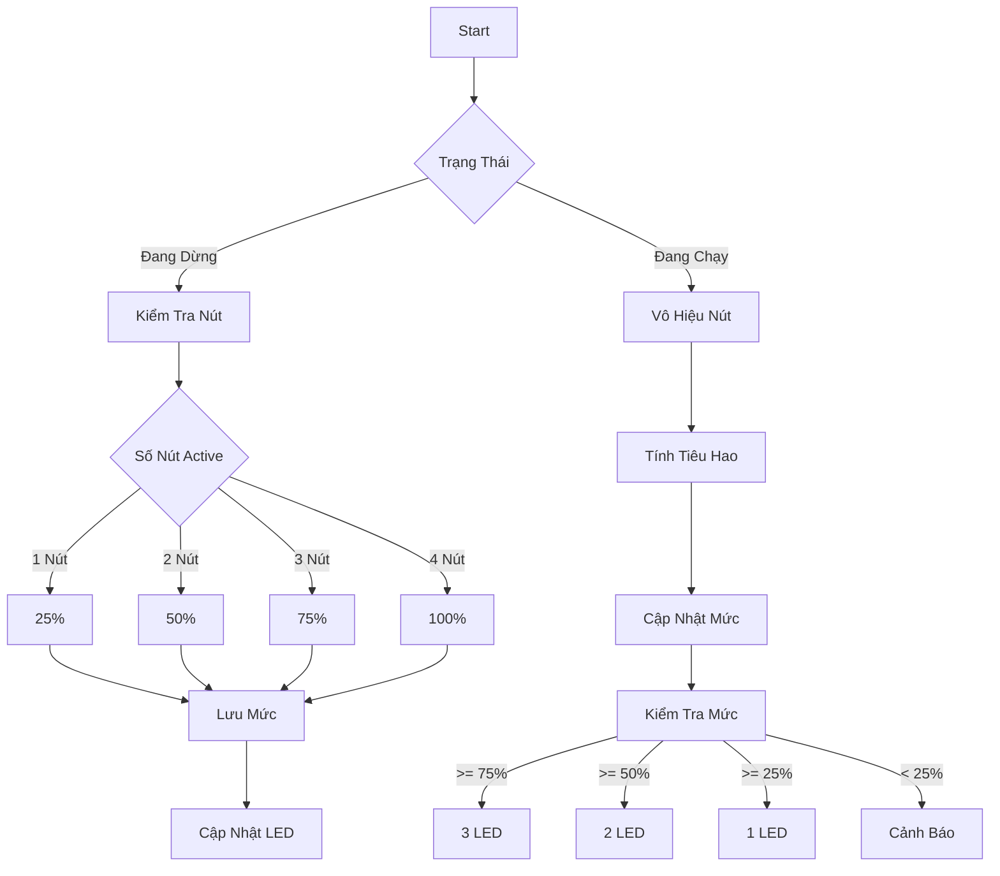
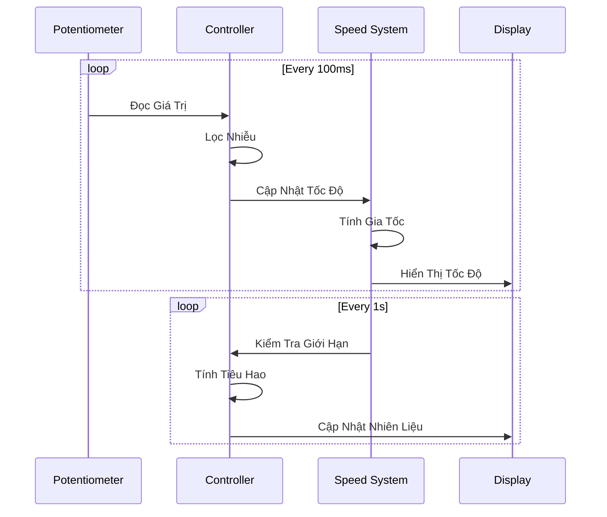
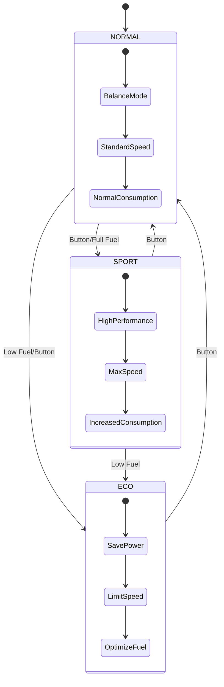
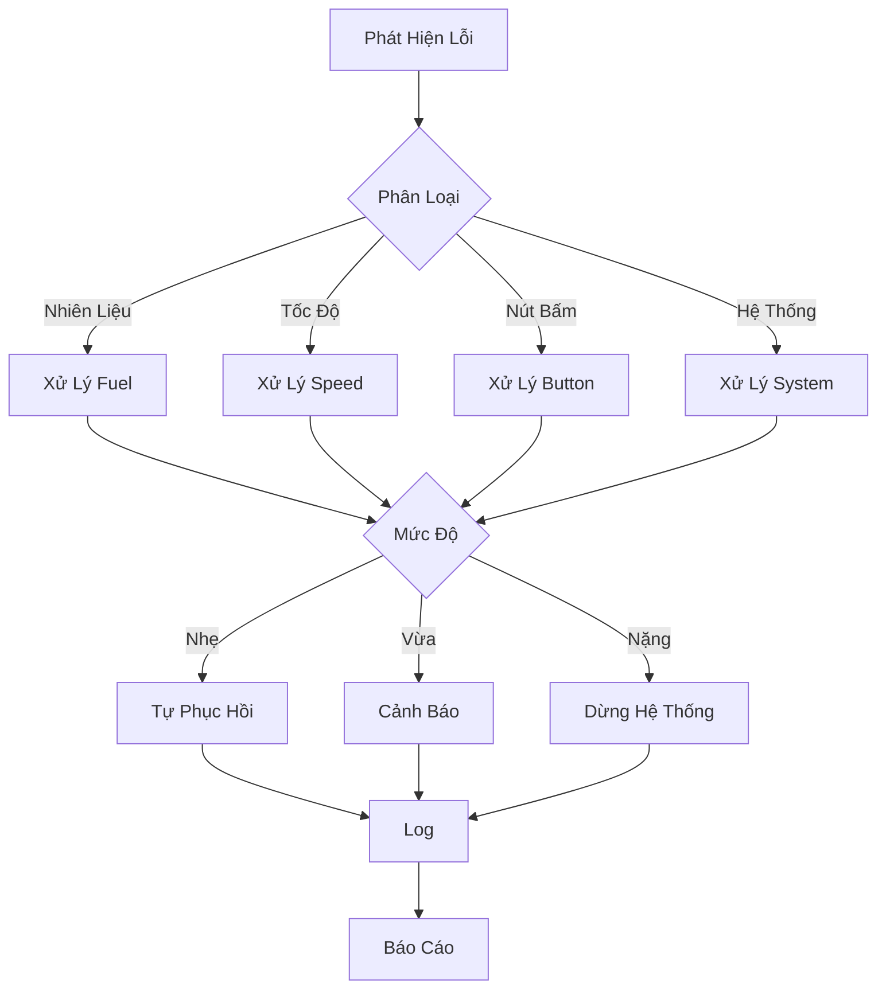

# Hệ Thống Dashboard Xe Đa Năng

## 1. Mô Tả Hệ Thống

Bảng điều khiển mô phỏng xe với khả năng chuyển đổi giữa các loại động cơ và chế độ lái khác nhau.

## 2. Tính Năng Chính

### 2.1. Chuyển Đổi Loại Xe

- **Button 1: Chuyển loại động cơ**
  - Xăng (Petrol)
  - Diesel
  - Điện (Electric)
  - LED RGB hiển thị trạng thái:
    - Đỏ: Xăng
    - Vàng: Diesel
    - Xanh: Điện

### 2.2. Chế Độ Lái

- **Button 2: Chuyển chế độ vận hành**
  - ECO: Tiết kiệm nhiên liệu/pin
  - NORMAL: Cân bằng
  - SPORT: Hiệu suất cao
  - LED RGB hiển thị:
    - Xanh lá: ECO
    - Trắng: NORMAL
    - Đỏ: SPORT

### 2.3. Điều Khiển Nhiên Liệu

- **4 Button Mô Phỏng Nạp Nhiên Liệu**
  - Button 3-6: Điều chỉnh mức nhiên liệu
  - Mỗi nút tương đương 25% mức nhiên liệu
  - Trạng thái hiển thị LED:
    - 1 nút = 25%
    - 2 nút = 50%
    - 3 nút = 75%
    - 4 nút = 100%

### 2.4. Điều Khiển Lái

- **Button 7: Start/Stop**
  - Start: Bắt đầu mô phỏng lái
  - Stop: Dừng xe, cho phép nạp nhiên liệu
  - Vô hiệu hóa buttons nạp khi đang chạy
  - Kích hoạt lại buttons theo mức còn lại khi dừng

### 2.5. Điều Khiển Tốc Độ

- **Biến Trở (Potentiometer)**
  - Điều chỉnh tốc độ mô phỏng
  - Range: 0-200 km/h
  - Ảnh hưởng đến mức tiêu thụ nhiên liệu

## 3. Quy Tắc Hoạt Động

### 3.1. Khởi Động Hệ Thống

### 3.2. Quy Trình Nạp Nhiên Liệu

### 3.3. Quy Trình Lái

## 4. Biến Dùng Chung và Race Conditions

### 4.1. Biến Nhiên Liệu (fuel_level)

- **Đọc bởi:**
  - Task hiển thị LED (hiển thị mức nhiên liệu)
  - Task OLED display (hiển thị thông số)
  - Task tính quãng đường còn đi được
  - Task kiểm tra cảnh báo nhiên liệu thấp
- **Ghi bởi:**
  - Task tính toán tiêu hao nhiên liệu
  - Task xử lý nút nạp nhiên liệu
- **Kịch bản xung đột:**
  - Đang hiển thị mức nhiên liệu khi có nạp thêm
  - Đang tính toán quãng đường khi nhiên liệu giảm
  - Hiển thị sai mức nhiên liệu khi nhiều task cùng đọc/ghi

### 4.2. Biến Tốc Độ (current_speed)

- **Đọc bởi:**
  - Task hiển thị tốc độ trên OLED
  - Task tính toán tiêu hao nhiên liệu
  - Task kiểm tra vượt tốc độ
  - Task điều khiển đèn LED
- **Ghi bởi:**
  - Task đọc biến trở tốc độ
  - Task xử lý phanh gấp
- **Kịch bản xung đột:**
  - Đang tính tiêu hao khi tốc độ thay đổi đột ngột
  - Hiển thị sai tốc độ khi phanh gấp
  - Cảnh báo vượt tốc không chính xác

### 4.3. Biến Chế Độ Lái (drive_mode)

- **Đọc bởi:**
  - Task hiển thị LED chế độ
  - Task tính toán tiêu hao
  - Task giới hạn tốc độ
  - Task điều chỉnh đèn nền
- **Ghi bởi:**
  - Task xử lý nút chuyển chế độ
  - Task tự động (khi nhiên liệu thấp)
- **Kịch bản xung đột:**
  - Đang tính tiêu hao khi chế độ thay đổi
  - LED hiển thị sai khi có chuyển chế độ tự động
  - Giới hạn tốc độ không đồng bộ với chế độ

### 4.4. Biến Trạng Thái Xe (vehicle_state)

- **Đọc bởi:**
  - Task kiểm tra nút nạp nhiên liệu
  - Task hiển thị trạng thái
  - Task xử lý chế độ tiết kiệm
- **Ghi bởi:**
  - Task xử lý nút Start/Stop
  - Task xử lý lỗi hệ thống
- **Kịch bản xung đột:**
  - Nạp nhiên liệu khi trạng thái chưa cập nhật
  - Hiển thị sai trạng thái khi có lỗi
  - Chế độ tiết kiệm không kích hoạt đúng

### 4.5. Biến Loại Động Cơ (engine_type)

- **Đọc bởi:**
  - Task tính toán tiêu hao
  - Task hiển thị thông số
  - Task điều chỉnh giới hạn tốc độ
- **Ghi bởi:**
  - Task xử lý nút chuyển loại động cơ
- **Kịch bản xung đột:**
  - Tính toán tiêu hao sai khi đang chuyển loại
  - Hiển thị thông số không đồng bộ
  - Giới hạn tốc độ không phù hợp

## 5. Quản Lý Task RTOS

### 5.1. Phân Chia Task Priority

1. **Ưu Tiên Cao Nhất (Priority 5)**
   - Xử lý ngắt nút bấm
   - Đọc biến trở tốc độ
   - Xử lý Start/Stop
   - Xử lý lỗi khẩn cấp

2. **Ưu Tiên Cao (Priority 4)**
   - Cập nhật LED trạng thái
   - Tính toán nhiên liệu
   - Xử lý chuyển chế độ
   - Kiểm tra giới hạn

3. **Ưu Tiên Trung Bình (Priority 3)**
   - Đọc DHT22
   - Hiển thị OLED
   - Tính quãng đường
   - Xử lý âm thanh

4. **Ưu Tiên Thấp (Priority 2)**
   - Ghi EEPROM
   - Gửi dữ liệu
   - Thống kê sử dụng
   - Backup trạng thái

### 5.2. Cơ Chế Bảo Vệ

1. **Mutex cho Shared Variables**
   - Timeout 10ms cho mọi operation
   - Check mutex success trước khi đọc/ghi
   - Release ngay sau khi dùng xong

2. **Critical Sections**
   - Disable interrupts khi cần thiết
   - Thời gian xử lý ngắn nhất có thể
   - Ưu tiên task đọc

3. **Đồng Bộ Dữ Liệu**
   - Buffer kép cho hiển thị
   - Atomic operations khi có thể
   - Kiểm tra tính hợp lệ dữ liệu

## 6. Đề Xuất Cải Tiến

### 6.1. Tính Năng Tương Tác

- **Mô Phỏng Phanh:**
  - Thêm nút bấm hoặc biến trở cho phanh
  - Ảnh hưởng đến tốc độ giảm
  - Đèn báo phanh LED

- **Tính Năng Vào Số:**
  - Thêm nút hoặc cần gạt số
  - Phản hồi âm thanh khi chuyển số
  - LED hiển thị số hiện tại

### 6.2. Cải Tiến Giao Diện

- **LCD/OLED Display:**
  - Hiển thị thông số chi tiết
  - Đồ thị tiêu thụ nhiên liệu
  - Menu cài đặt và thông tin

- **LED Matrix:**
  - Hiệu ứng đổ đầy khi nạp nhiên liệu
  - Thanh tiến trình tốc độ
  - Animation chuyển chế độ

### 6.3. Tính Năng Thông Minh

- **Tự Động Hóa:**
  - Tự chuyển ECO khi nhiên liệu dưới 20%
  - Cảnh báo khi tốc độ vượt ngưỡng
  - Gợi ý thời điểm nạp nhiên liệu

- **Thống Kê:**
  - Lưu lịch sử sử dụng
  - Tính hiệu suất từng chế độ
  - Đề xuất chế độ tối ưu

## 7. Sơ Đồ Chi Tiết Các Hệ Thống Con

### 7.1. Quản Lý Loại Động Cơ

### 7.2. Xử Lý Nhiên Liệu và Nút Bấm

### 7.3. Hệ Thống Điều Khiển Tốc Độ

### 7.4. Hệ Thống Điều Khiển Chế Độ

### 7.5. Hệ Thống Xử Lý Lỗi

