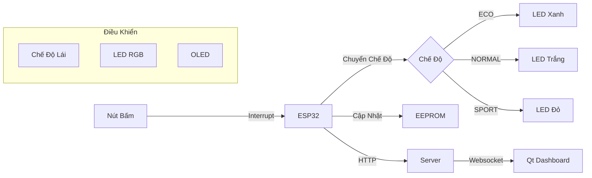
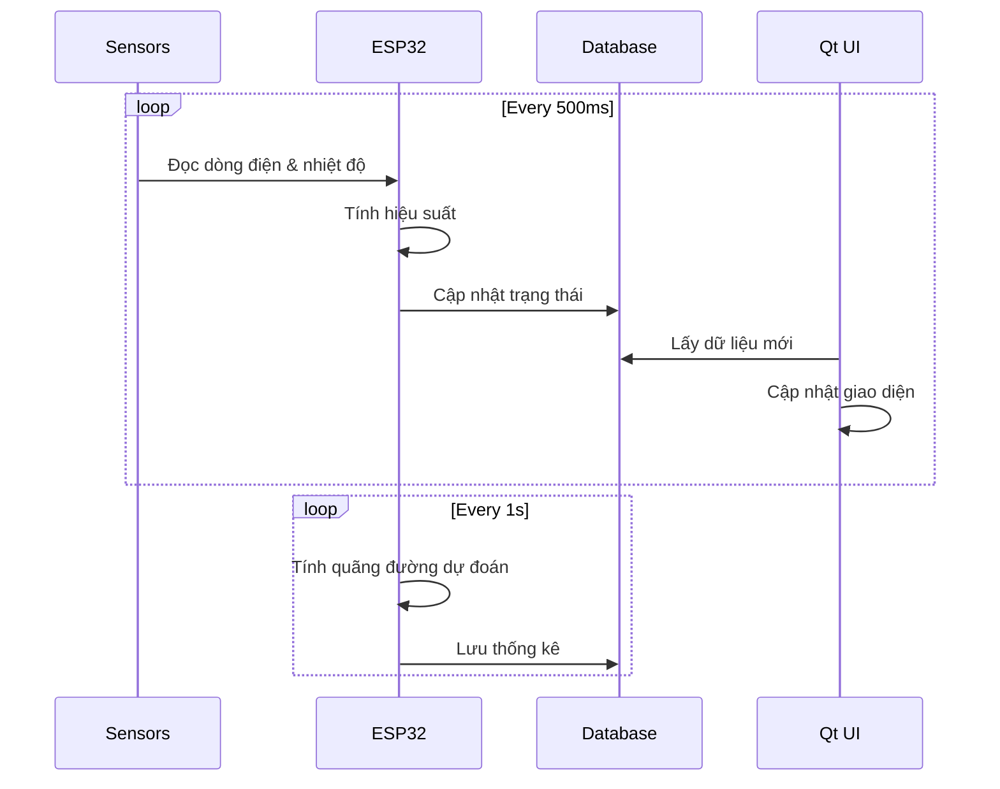
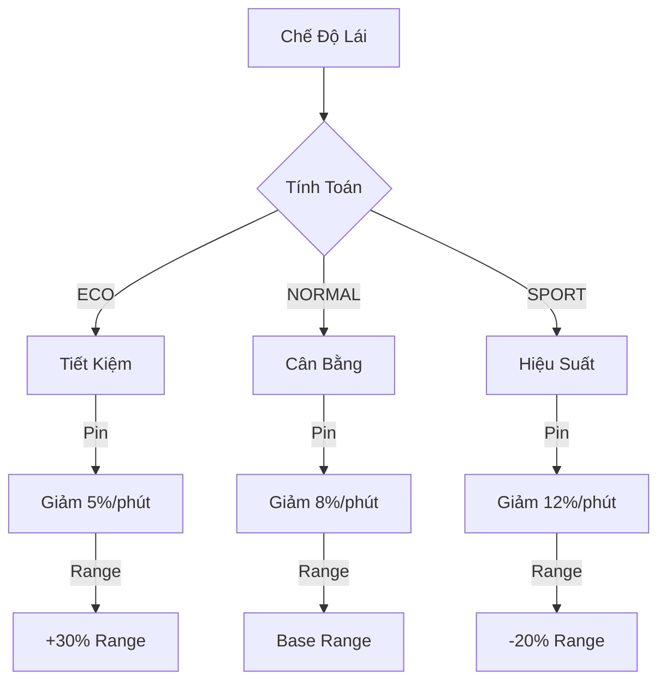
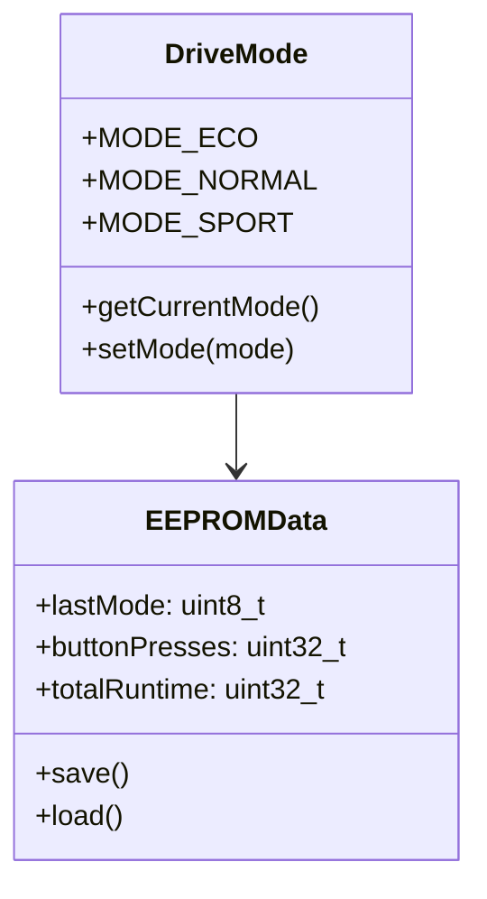

# Hệ Thống Dashboard Xe Điện Thông Minh

## 1. Mục Tiêu
Xây dựng hệ thống bảng điều khiển xe điện hiện đại với giao diện sci-fi, tích hợp đa cảm biến và tối ưu năng lượng.

## 2. Yêu Cầu Chức Năng

### 2.1. Giao Diện Dashboard
- **Hiển thị tốc độ:**
  * Đồng hồ số 0-180 km/h
  * Kim chỉ với màu sắc thay đổi theo mức tiêu thụ điện
  * Hiển thị công suất động cơ hiện tại (kW)

- **Hiển thị pin và phục hồi năng lượng:**
  * LED strip hiển thị mức pin (0-100%)
  * Gauge hiển thị tái tạo năng lượng khi phanh
  * Dự đoán quãng đường dựa trên mức pin và tiêu thụ

- **Hiển thị chế độ lái (Drive Mode):**
  * ECO: Tối ưu tiết kiệm pin
  * NORMAL: Cân bằng hiệu suất
  * SPORT: Tối đa công suất
  * Hiệu ứng chuyển đổi với LED RGB

- **Thông số vận hành:**
  * Nhiệt độ pin và động cơ
  * Độ ẩm hệ thống làm mát
  * Hiệu suất sạc và xả

### 2.2. Phần Cứng ESP32
- **Điều Khiển Chế Độ:**
  * Nút bấm chuyển đổi chế độ lái (ECO/NORMAL/SPORT)
  * LED RGB hiển thị chế độ hiện tại
    - Xanh: ECO mode
    - Trắng: Normal mode
    - Đỏ: Sport mode
  * Lưu chế độ vào EEPROM

- **Mô Phỏng Dữ Liệu:**
  * Pin và hiệu suất thay đổi theo chế độ
  * Đọc nhiệt độ từ DHT22
  * Tính toán quãng đường dự kiến
  * Nút chọn chế độ lái tinh chỉnh
  * LED RGB hiển thị trạng thái
  * OLED hiển thị chi tiết

### 2.3. Xử Lý Dữ Liệu
- **EEPROM:**
  * Lưu lịch sử tiêu thụ điện
  * Thống kê hiệu suất pin
  * Cấu hình chế độ lái ưa thích

## 3. Quản Lý Tài Nguyên

### 3.1. Độ Ưu Tiên Task
- **Cao Nhất:**
  * Giám sát pin và nhiệt độ
  * Tính toán hiệu suất real-time
  * Điều khiển chế độ lái

- **Trung Bình:**
  * Animation giao diện
  * Tính toán dự đoán quãng đường
  * Hiển thị thông số chi tiết

- **Thấp Nhất:**
  * Đồng bộ dữ liệu
  * Phân tích xu hướng tiêu thụ
  * Backup cấu hình

### 3.2. Quản Lý Bộ Nhớ
- **EEPROM:**
  * Profile người lái
  * Lịch sử vận hành
  * Thông số hiệu chuẩn pin
  * Chế độ lái yêu thích
  * Số km còn lại

### 3.3. Kỹ Thuật
- ESP32 + DHT22 + Cảm biến dòng điện
- Server PHP/MySQL với phân tích dữ liệu
- Cập nhật: 500ms/lần cho dữ liệu quan trọng

## 4. Kiến Trúc Hệ Thống

### 4.1. Điều Khiển Chế Độ Lái

### 4.2. Luồng Dữ Liệu Thời Gian Thực

### 4.3. Mô Phỏng Theo Chế Độ

### 4.4. Lưu Trữ EEPROM

